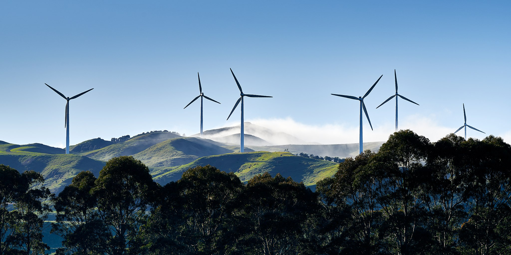

# Green Development Planner

We are aiming for a greener planet.

{width="893"}

Geoff McKay, CC BY 2.0 <https://creativecommons.org/licenses/by/2.0>, via Wikimedia Commons

# Summary

This is a data visualization dashboard to aid policy makers and funding bodies in allocating aid funds effectively for renewable energy infrastructure in developing countries. By providing insights into energy needs, current energy usage, and renewable potential, the dashboard will guide the strategic distribution of resources to areas where they can have the most significant impact on sustainable development and energy access.

## A quick overview

Our dashboard offers a high-level overview of renewable energy metrics across the globe. The interactive world map enables users to select and visualize data spanning 20 years, featuring six key indicators: the percentage of renewable energy in total energy consumption, electricity access rates (% of population), financial investments in clean energy projects, and electricity generation breakdown by sources (i.e., fossil fuels, nuclear, and renewables) for each country. A time slider allows for a historical perspective on these indicators.

On the right, the dashboard provides a country-specific analysis with two pie charts and two bar charts. The pie charts display the average share of renewable energy and the electricity generation mix over the last five years. The bar charts compares a country's electricity access and financial flow for clean energy against the world average, again over the last five years. By using the average data of a latest five-year period, we ensure that the information captures the most recent situations, offering users an up-to-date, actionable snapshot of energy development.


## Use the App

Explore our dashboard to unlock insights into renewable energy access [here](https://dsci-532-2024-6-green-development-planner.onrender.com/). Intuitive controls and dynamic visuals guide strategic resource allocation. Dive in to make informed decisions for sustainable growth.

## How to get support?

Need help or feedback? Open an issue on our GitHub – we're ready to assist your journey towards informed actions for a sustainable future.

## Developer's Guide

### Step 1: Clone the repository

Start by cloning the repository to your local machine. Open your terminal and run the following command:

``` bash
$ git clone git@github.com:UBC-MDS/DSCI-532_2024_6_Green-Development-Planner.git
```

### Step 2: Create the virtual environment

Create a new Conda environment using the `environment.yaml` file provided in this repository. This file contains all the necessary dependencies, including both Python and Poetry versions.

To create the environment, open your terminal and navigate to the directory where the `environment.yaml` file is located. Then, run the following command:

``` bash
$ conda env create -f environment.yaml
$ conda activate green-development-planner
```

### Step 3: Configure the Application for Development

For development purpose, set `debug=True` in file `src/app.py`.

``` bash
if __name__ == "__main__":
    app.run(debug=True)
```

### Step 4: Run the dashboard

Navigate to the project root directory and use the following command.

``` bash
$ python ./src/app.py
```

## Contributing

Contributions are welcome! Check out the [contributing guidelines](CONTRIBUTING.md). Please note that this project is released with a [Code of Conduct](CONDUCT.md). By contributing to this project, you agree to abide by its terms.

## Contributors

- Ben Chen ([\@phchen5](https://github.com/phchen5))
- Yi Han ([\@yhan178](https://github.com/yhan178))
- Ian MacCarthy ([\@ianm99](https://github.com/ianm99))
- Joey Wu ([\@joeywwwu](https://github.com/joeywwwu))

## License

This Green Development Planner dashboard was created by Ben Chen, Yi Han, Ian MacCarthy, and Joey Wu. It is licensed under the terms of the [MIT license](LICENSE).